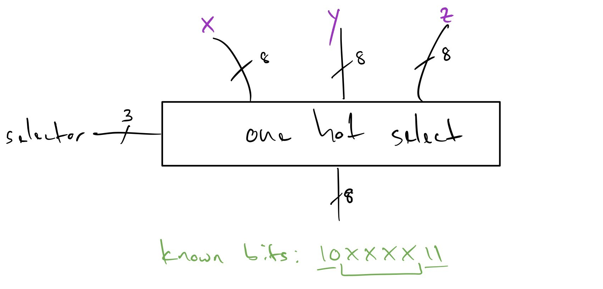
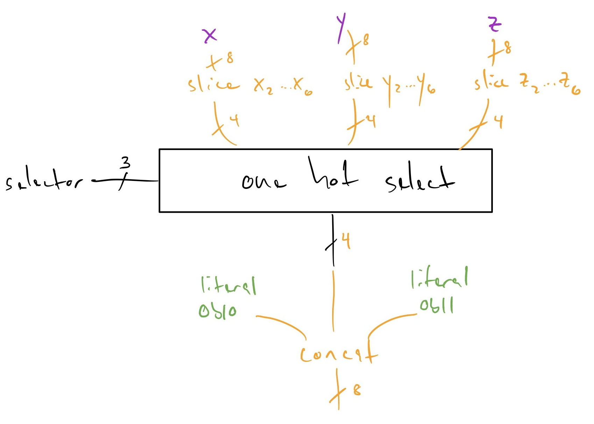
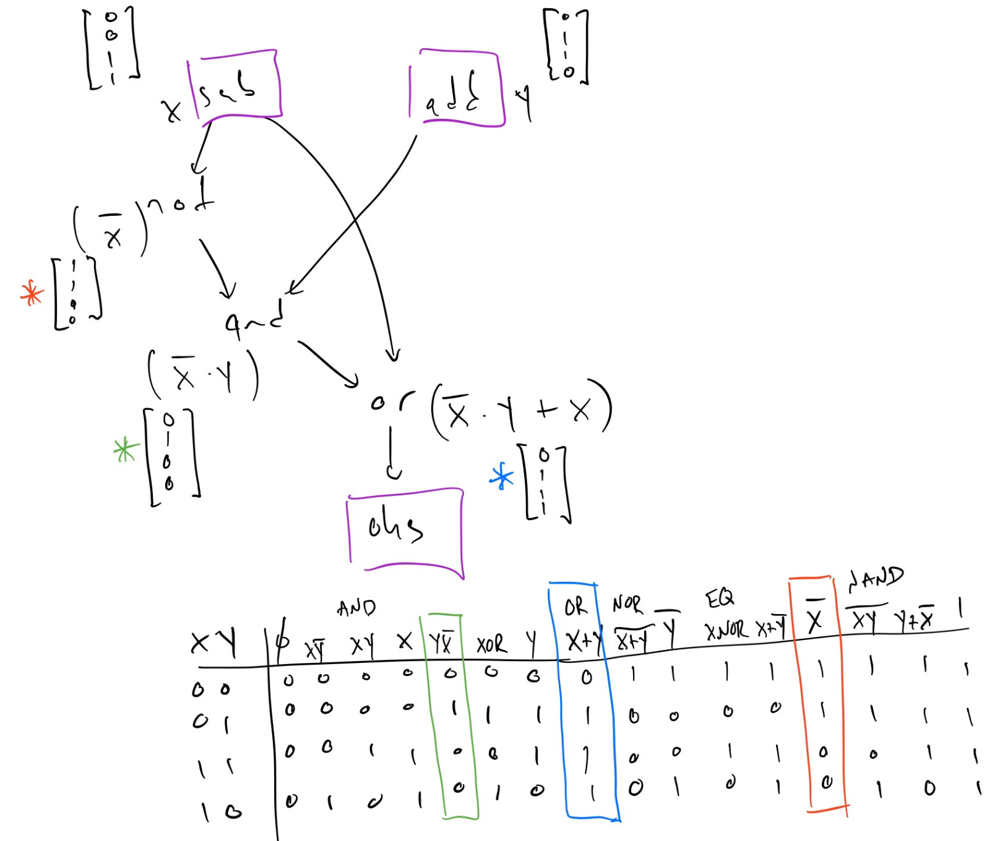
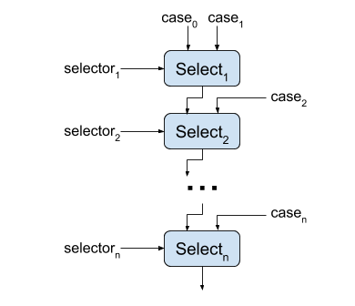
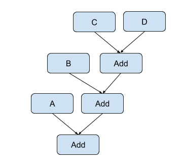
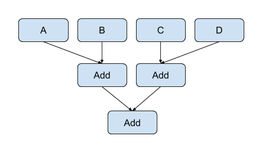
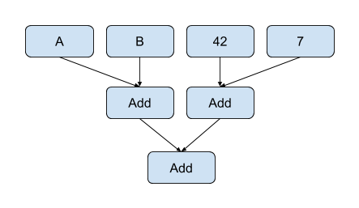

# XLS Optimizations

[TOC]

## Narrowing Optimizations

The XLS compiler performs **bitwise flow analysis**, and so can deduce that
certain bits in the output of operations are always-zero or always-one. As a
result, after running this bit-level tracking flow analysis, some of the bits on
the output of an operation may be "known". With known bits in the output of an
operation, we can often narrow the operation to only produce the *unknown* bits
(those bits that are not known static constants), which reduces the "cost" of
the operation (amount of delay through the operation) by reducing its bitwidth.

### Select operations

An example of this is select narrowing, as shown in the following -- beforehand
we have three operands, but from our bitwise analysis we know that there are two
constant bits in the MSb as well as two constant bits in the LSb being
propagated from all of our input operands.

{style="display:block;margin:auto;width:50%"}

Recognizing that property, we squeeze the one hot select operation -- in the
"after" diagram below observe we've narrowed the operation by slicing the
known-constant bits out of the one hot select operation, making it cheaper in
terms of delay, and propagated the slices up to the input operands -- these
slices being presented at the output of the operands may in turn let *them*
narrow their operation and become cheaper, and this can continue transitively):

{style="display:block;margin:auto;width:50%"}

### Arithmetic and shift operations

Most arithmetic ops support mixed bit widths where the operand widths may not be
the same width as each other or the result. This provides opportunities for
narrowing. Specifically (for multiplies, adds and subtracts):

1.  If the operands are wider than the result, the operand can be truncated to
    the result width.

1.  If the operation result is wider than the full-precision width of the
    operation, the operation result can be narrowed to the full-precision width
    then sign- or zero-extended (depending upon the sign of the operation) to
    the original width to produce the desired result. The full-precision width
    of an add or subtract is one more than the width of the widest operand, and
    the full-precision width of a multiply is the sum of the operand widths.

1.  If the most-significant bit of an operand are zeros (for unsigned
    operations) or the same as the sign-bit value (for signed operations), the
    operand can be narrowed to remove these known bits.

As a special case, adds can be narrowed if the least-significant bits of an is
all zeros. The add operation is narrowed to exclude this range of
least-significant bits. The least-significant bits of the result are simply the
least-significant bits of the non-zero operand:


Similarly, if the most-significant bits of the shift-amount of a shift operation
are zero the shift amount can be narrowed.

### Comparison operations

Leading and trailing bits can be stripped from the operands of comparison
operations if these bits do not affect the result of the comparison. For
unsigned comparisons, leading and trailing bits which are identical between the
two operands can be stripped which narrows the comparison and reduces the cost
of the operation.

Signed comparison are more complicated to handle because the sign bit
(most-significant bit) affects the interpretation of the value of the remaining
bits. Stripping leading bits must preserve the sign bit of the operand.

### Known-literals and `ArrayIndex`

The narrowing pass also converts any node that is determined by range analysis
to have a range containing only one value into a literal. As a further extension
of this idea, it also converts `ArrayIndex` nodes that are determined to have a
small number of possible indices into select chains.

This latter optimization is sometimes harmful, so we currently hide it behind
the `--convert_array_index_to_select=<n>` flag in `opt_main` and
`benchmark_main`, where `<n>` controls the number of possible array indices
above which the optimization does not fire. The right number to put there is
highly contextual, since this optimization relies heavily on later passes to
clean up its output.

## Strength Reductions

### Arithmetic Comparison Strength Reductions

When arithmetic comparisons occur with respect to constant values, comparisons
which are be arithmetic in the general case may be strength reduced to more
boolean-analyzeable patterns; for example, comparison with mask constants:

```
u4:0bwxyz > u4:0b0011
```

Can be strength reduced -- for the left hand side to be greater one of the `wx`
bits must be set, so we can simply replace this with an or-reduction of `wx`.
Similarly, a trailing-bit and-reduce is possible for less-than comparisons.

NOTE These examples highlight a set of optimizations that are not applicable
(profitable) on traditional CPUs: the ability to use bit slice values below what
we'd traditionally think of as a fundamental comparison "instruction", which
would nominally take a single cycle.

## "Simple" Boolean Simplification

NOTE This optimization is a prelude to a more general optimization we expect to
come in the near future that is based on Binary Decision Diagrams. It is
documented largely as a historical note of an early / simple optimization
approach.

With the addition of the `one_hot_select` and its corresponding optimizations, a
larger amount of boolean logic appears in XLS's optimized graphs (e.g. or-ing
together bits in the selector to eliminate duplicate `one_hot_select` operands).
Un-simplified boolean operations compound their delay on the critical path; with
the process independent constant $\tau$ a single bit `or` might be $6\tau$,
which is just to say that having lots of dependent `or` operations can
meaningfully add up in the delay estimation for the critical path. If we can
simplify several layers of boolean operations into one operation (say, perhaps
with inputs optionally inverted) we could save a meaningful number of tau versus
a series of dependent boolean operations.

For a simple approach to boolean simplification:

*   The number of parameters to the boolean function is limited to three inputs
*   The truth table is computed for the aggregate boolean function by flowing
    input bit vectors through all the boolean operation nodes.
*   The result bit vectors on the output frontier are matched the resulting
    truth table from the flow against one of our standard operations (perhaps
    with the input operands inverted).

The algorithm starts by giving `x` and `y` their vectors (columns) from the
truth table, enumerating all possible bit combinations for those operands. For
example, consider two operands and a (bitwise) boolean function, the following
is the truth table:

```
X Y | X+~Y
----+------
0 0 |  1
0 1 |  0
1 0 |  1
1 1 |  1
```

Each column in this table is a representation of the possibilities for a node in
the graph to take on, as a vector. After giving the vector `[0, 0, 1, 1]` to the
first input node (which is arbitrarily called X) and the vector `[0, 1, 0, 1]`
to the second input node (which is arbitrarily called Y), and flowing those bit
vectors through a network of boolean operations, if you wind up with a vector
`[1, 0, 1, 1]` at the end, it is sound to replace that whole network with the
expression `X+~Y`. Similarly, if the algorithm arrived at the vector `[1, 1, 1,
1]` at the end of the network, you could replace the result with a literal `1`,
because it has been proven for all input operand possibilities the result is
always `1` in every bit. Effectively, this method works by brute force
enumerating all the possibilities for input bits and operating on all of those
possibilities at the same time. In the end, the algorithm arrives at a composite
boolean function that can be pattern matched against XLS's set of "simple
boolean functions".

In the following example there are two nodes on the "input frontier" for the
boolean operations (`sub` and `add`, which we "rename" to `x` and `y` for the
purposes of analysis).

{style="display:block;margin:auto;width:75%"}

As shown in the picture, the algorithm starts flowing the bit vector, which
represents all possible input values for `x` and `y`. You can see that the `not`
which produces $\bar{x}$ (marked with a red star) simply inverts all the entries
in the vector and corresponds to the $\bar{x}$ column in the truth table.
Similarly the `and` operation joins the two vector with the binary `&`
operation, and finally we end up with the blue-starred bit vector on the "output
frontier", feeding the dependent `one_hot_select` (marked as `ohs` in the
diagram).

When we resolve that final result bit vector with the blue star against our
table of known function substitutions, we see that the final result can be
replaced with a node that is simply `or(x, y)`, saving two unnecessary levels of
logic, and reducing the critical path delay in this example from something like
$13\tau$ to something like $6\tau$.

This basic procedure is then extended to permit three variables on the input
frontier to the boolean expression nodes, and the "known function" table is
extended to include all of our supported logical operators (i.e. `nand`, `nor`,
`xor`, `and`, `or`) with bit vectors for all combinations of inputs being
present, and when present, either asserted, or their inversions (e.g. we can
find $nand(\bar{X}, Y)$ even though X is inverted).

## Bit-slice optimizations

Bit-slice operations narrow values by selecting a contiguous subset of bits from
their operand. Bit-slices are zero-cost operations as no computation is
performed. However, optimization of bit-slices can be beneficial as bit-slices
can interfere with optimizations and hoisting bit-slices can narrow other
operations reducing their computation cost.

### Slicing sign-extended values

A bit-slice of a sign-extended value is a widening operation followed by a
narrowing operation and can be optimized. The details of the transformation
depends upon relative position of the slice and the sign bit of the original
value. Let `sssssssXXXXXXXX` be the sign-extended value where `s` is the sign
bit and `X` represents the bits of the original value. There are three possible
cases:

1.  Slice is entirely within the sign-extend operand.

    

    **Transformation:** replace the bit-slice of the sign-extended value with a
    bit-slice of the original value.

1.  Slice spans the sign bit of the sign-extend operand.

    

    **Transformation:** slice the most significant bits from the original value
    and sign-extend the result.

1.  Slice is entirely within the sign-extended bits.

    

    **Transformation:** slice the sign bit from the original value and
    sign-extend it.

To avoid introducing additional sign-extension operations cases (2) and (3)
should only be performed if the bit-slice is the only user of the
sign-extension.

## Concat optimizations

`Concat` (short for concatenation) operations join their operands into a single
word. Like `BitSlice`s, `Concat` operations have no cost since since they simply
create a new label to refer to a set of bits, performing no actual computation.
However, `Concat` optimizations can still provide benefit by reducing the number
of IR nodes (increases human readability) or by refactoring the IR in a way that
allows other optimizations to be applied. Several `Concat` optimizations involve
hoisting an operation on one or more `Concat`s to above the `Concat` such that
the operation is applied on the `Concat` operands directly. This may provide
opportunities for optimization by bringing operations which actually perform
logic closer to other operations performing logic.

### Hoisting a reverse above a concat

A `Reverse` operation reverses the order of the bits of the input operand. If a
`Concat` is reversed and the `Concat` has no other consumers except for
reduction operations (which are not sensitive to bit order), we hoist the
`Reverse` above the `Concat`. In the modified IR, the `Concat` input operands
are `Reverse`'d and then concatenated in reverse order, e.g. :

```
Reverse(Concat(a, b, c))
=> Concat(Reverse(c), Reverse(b), Reverse(a))
```

### Hoisting a bitwise operation above a concat

If the output of multiple `Concat` operations are combined with a bitwise
operation, the bitwise operation is hoisted above the `Concat`s. In the modified
IR, we have a single `Concat` whose operands are bitwise'd `BitSlice`s of the
original `Concat`s, e.g. :

```
Or(Concat(A, B), Concat(C, D)), where A,B,C, and D are 1-bit values
=> Concat(Or(Concat(A, B)[1], Concat(C, D)[1]), Or(Concat(A, B)[0], Concat(C, D)[0]))
```

In the case that an added `BitSlice` exactly aligns with an original `Concat`
operand, other optimizations (bit slice simplification, constant folding, dead
code elimination) will replace the `BitSlice` with the operand, e.g. for the
above example:

```
=> Concat(Or(A, C), Or(B, D))
```

### Merging consecutive bit-slices

If consecutive `Concat` operands are consecutive `BitSlice`s, we create a new,
merged `BitSlice` spanning the range of the consecutive `BitSlice`s. Then, we
create a new `Concat` that includes this `BitSlice` as an operand, e.g.

```
Concat(A[3:2], A[1:0], B)
=> Concat(A[3:0], B)
```

This optimization is sometimes helpful and sometimes harmful, e.g. in the case
that there are other consumers of the original `BitSlice`s, we may only end up
adding more IR nodes since the original `BitSlice`s will not be removed by DCE
once they are replaced in the `Concat`. Some adjustments might be able to help
with this issue. An initial attempt at this limited the application of this
optimization to cases where the given`Concat` is the only consumer of the
consecutive `BitSlice`s. This limited the more harmful applications of this
optimization, but also reduced instances in which the optimization was
beneficially applied (e.g. the same consecutive `BitSlice`s could be merged in
multiple `Concat`s).

## Select optimizations

XLS supports two types of select operations:

1.  `Select` (opcode `Op::kSel`) is a traditional multiplexer. An `n`-bit
    binary-encoded selector chooses among 2**`n` inputs.

1.  `OneHotSelect` (opcode `Op::kOneHotSel`) has one bit in the selector for
    each input. The output of the operation is equal to the logical-or reduction
    of the inputs corresponding to the set bits of the selector. Generally, a
    `OneHotSelect` is lower latency and area than a `Select` as a `Select` is
    effectively a decode operation followed by a `OneHotSelect`.

### Converting chains of `Select`s to into a single `OneHotSelect`

A linear chain of binary `Select` operations may be produced by the front end to
select amongst a number of different values. This is equivalent to nested
ternary operators in C++.



A chain of `Select`s has high latency, but latency may be reduced by converting
the `Select` chain into a single `OneHotSelect`. This may only be performed if
the single-bit selectors of the `Select` instructions are one-hot (at most one
selector is set at one time). In this case, the single-bit `Select` selectors
are concatenated together to produce the selector for the one hot.


This effectively turns a serial operation into a lower latency parallel one. If
the selectors of the original `Select` instructions can be all zero (but still
at most one selector is asserted) the transformation is slightly modified. An
additional selector which is the logical NOR of all of the original `Select`
selector bits is appended to the `OneHotSelect` selector and the respective case
is the value selected when all selector bits are zero (`case_0` in the diagram).

### Specializing select arms

Within any given arm of a `Select` multiplexer, we can assume that the
selector has the specific value required to select that arm. This assumption
is safe because in the event that the selector has a different value, the
arm is dead.


This makes it possible to try specialize the arms based on the selector
value. In the above example, a LHS of `Selector + x` could be simplified to
`0 + x`.

The current optimization simply substitutes any usages of the selector in a
`Select` arm with its known value in that arm. Future improvements could use
range based analysis or other techniques to narrow down the possible values of
any variables within the selector, and use that information to optimize the
select arms.

### Consecutive selects with identical selectors

Two consecutive two-way selects which use the same selector can be compacted
into a single select statement. The selector only has two states so only two of
the three different cases may be selected. The third is dead. Visually, the
transformation looks like:


The specific cases which remain in the new select instruction depends on whether
the upper select feeds the true or false input of the lower select.

### Sparsifying selects with range analysis

If range analysis determines that the selector of a select has fewer possible
values than the number of cases, we can do a form of dead code elimination to
remove the impossible cases.

Currently, we do this in the following way:

```
// Suppose bar has interval set {[1, 4], [6, 7], [10, 13]}
foo = sel(bar, cases=[a1, ..., a16])
// Sparsification will lead to the following code:
foo = sel((bar >= 1) && (bar <= 4), cases=[
  sel((bar >= 6) && (bar <= 7), cases=[
    sel(bar - 10, cases=[a11, ..., a14], default=0),
    sel(bar - 6, cases=[a7, a8], default=0)
  ]),
  sel(bar - 1, cases=[a2, ..., a5], default=0)
])
```

This adds a little bit of code for the comparisons and subtractions but is
generally worth it since eliminating a case branch can be a big win.

## Binary Decision Diagram based optimizations

A binary decision diagram (BDD) is a data structure that can represent arbitrary
boolean expressions. Properties of the BDD enable easy determination of
relationships between different expressions (equality, implication, etc.) which
makes them useful for optimization and analysis

### BDD common subexpression elimination

Determining whether two expression are equivalent is trivial using BDDs. This
can be used to identify operations in the graph which produce identical results.
BDD CSE is an optimization pass which commons these equivalent operations.

### OneHot MSB elimination

A `OneHot` instruction returns a bitmask with exactly one bit equal to 1. If the
input is not all-0 bits, this is the first 1 bit encountered in the input going
from least to most significant bit or vice-versa depending on the priority
specified. If the input is all-0 bits, the most significant bit of the `OneHot`
output is set to 1. The semantics of `OneHot` are described in detail
[here](./ir_semantics.md). If the MSB of a `OneHot`
does not affect the functionality of a program, we replace the MSB with a 0-bit,
e.g.

```
OneHot(A) such that the MSB has no effect
⇒ Concat(0, OneHot(A)[all bits except MSB]))
```

This can open up opportunities for further optimization. To determine if a
`OneHot`’s MSB has any effect on a function, we iterate over the `OneHot`’s
post-dominators. We use the BDD to test if setting the `OneHot`’s MSB to 0 or to
1 (other bits are 0 in both cases) implies the same value for the post-dominator
node. If so, we know the value of the MSB cannot possibly affect the function
output, so the MSB can safely be replaced with a 0 bit. Note: This approach
assumes that IR nodes do not have any side effects. When IR nodes with side
effects are introduced (i.e. channels) the analysis for this optimization will
have to be adjusted slightly to account for this.

## Traditional compiler optimizations

Many optimizations from traditional compilers targeting CPUs also apply to the
optimization of hardware. Common objectives of traditional compiler
optimizations include exposing parallelism, reducing latency, and eliminating
instructions. Often these translate directly into the primary objectives of
hardware optimization of reducing delay and area.

### Dead Code Elimination (DCE)

Dead Code Elimination (DCE for short) is usually one of the easiest
and most straightforward optimization passes in compilers. The same is
true for XLS (the implementation is in
`xls/passes/dce_pass.*`). Understanding the pass is also a good way to
familiarize yourself with basics of the compiler IR, how to implement
a pass, how to iterate over the nodes in the IR, how to query for node
properties and so on.

In general, DCE removes nodes from the IR that cannot be reached.
Nodes can become unreachable by construction, for example, when a
developer writes side-effect-free computations in DSLX that are
disconnected from the function return ops. Certain optimization passes
may also result in dead nodes.

Let's look at the structure of the pass. The header file is
straightforward, The `DeadCodeEliminationPass` is a function-level
pass and hence derived from `FunctionBasePass`. Every function-level
pass must implement the function `RunOnFunctionBaseInternal` and
return a status indicating whether or not the pass made a change to
the IR:


```c++
class DeadCodeEliminationPass : public FunctionBasePass {
 public:
  DeadCodeEliminationPass()
      : FunctionBasePass("dce", "Dead Code Elimination") {}
  ~DeadCodeEliminationPass() override {}

 protected:
  // Iterate all nodes, mark and eliminate the unvisited nodes.
  absl::StatusOr<bool> RunOnFunctionBaseInternal(
      FunctionBase* f, const PassOptions& options,
      PassResults* results) const override;
};
```

Now let's look at the implementation (in file
`xls/passes/dce_pass.cc`). After the function declaration:

```c++
absl::StatusOr<bool> DeadCodeEliminationPass::RunOnFunctionBaseInternal(
    FunctionBase* f, const PassOptions& options, PassResults* results) const {
```

There is a little lambda function testing whether a node is deletable or not:

```c++
  auto is_deletable = [](Node* n) {
    return !n->function_base()->HasImplicitUse(n) &&
           !OpIsSideEffecting(n->op());
  };
```

This function tests for two special classes of nodes.

* A node with implicit uses (defined in `xls/ir/function.h`) is a
  function's return value. In case of procs, the return is not
  reached and may appear as dead. It must not be removed as XLS
  expects each function to have a return value.

*  There are a number of side-effecting nodes, such as send/receive
   operations, asserts, covers, input / output ports, register
   read / writes, or parameters (and a few more). Because of their
   side effects, they must not be eliminated by DCE.

Next the pass iterates over all nodes in the function and adds
deletable nodes with no users to a worklist. Those are leaf nodes,
they are the initial candidates for deletion:


```c++
  std::deque<Node*> worklist;
  for (Node* n : f->nodes()) {
    if (n->users().empty() && is_deletable(n)) {
      worklist.push_back(n);
    }
  }
```

Now on to the heart of the DCE algorithm. The algorithm iterates over
nodes in the worklist until it is empty, popping elements from the
front of the list and potentially adding new elements to the list. For
example, assume there was a leaf node A with no further users. Further
assume that its operand(s) only have node A as user, then the operand
will be added to the worklist and visited in the next iteration over
the worklist. There is a minor subtlety here - the code has to ensure
that operands are only visited once, hence the use of a
`flat_hash_set<Node*>` to check whether an operand has been visited
already.

After all operands have been visited and potentially added to the
worklist, the original leaf node A is being removed and a
corresponding logging statement (level 3) is generated.

```c++
  int64_t removed_count = 0;
  absl::flat_hash_set<Node*> unique_operands;
  while (!worklist.empty()) {
    Node* node = worklist.front();
    worklist.pop_front();

    // A node may appear more than once as an operand of 'node'. Keep track of
    // which operands have been handled in a set.
    unique_operands.clear();
    for (Node* operand : node->operands()) {
      if (unique_operands.insert(operand).second) {
        if (operand->users().size() == 1 && is_deletable(operand)) {
          worklist.push_back(operand);
        }
      }
    }
    XLS_VLOG(3) << "DCE removing " << node->ToString();
    XLS_RETURN_IF_ERROR(f->RemoveNode(node));
    removed_count++;
  }
```

Finally, a pass has to indicate whether or not it made any changes to
the IR. For this pass, this amounts to returning whether or not a
single IR node has been DCE'ed:

```c++
  XLS_VLOG(2) << "Removed " << removed_count << " dead nodes";
  return removed_count > 0;
}
```

### Common Subexpression Elimination (CSE)

Common subexpression elimination is another example of a classic compiler
optimization that equally applies to high-level synthesis. The heuristics on
which specific expressions to commonize may differ, given that commonizing
expressions can increase fan-out and connectivity of the IR, complicating place
and route. Currently, XLS is greedy and does not apply heuristics. It commonizes
any and all common expressions it can find. The CSE implementation can be found
in files `xls/passes/cse_pass.*`.

What does CSE actually do? The principles are quite simple and similar in
classic control-flow based compilers. Yet, as mentioned, the heuristics may be
moderately different. In CFG-based IRs, CSE would look for common expressions
and substitute in temporary variables.  For example, for code like this with the
common expression `a+b`:

```c++
   x = a + b + c;
   if (cond) {
      ...
   } else {
      y = b + a;
   }
```

The compiler would first determine that addition is commutative and that hence
the expressions `a+b` and `b+a` can be canonicalized, eg., by ordering the
operands alphabetically. Then the compiler would introduce a temporary variable
for the expression and forward-substitute it into all occurances. For the
example, the resulting code would be something like this:

```c++
   t1 = a + b
   x = t1 + c;
   if (cond) {
      ...
   } else {
      y = t1;
   }
```

In effect, an arithmetic operation has been traded against a register (or cache)
access. Even in classic compilers, the CSE heuristics may consider factors such
as the length and number of live ranges (and corresponding register pressure) to
determine whether or not it may be better to just recompute the expression.

In XLS's "sea of nodes" IR, this transformation is quite simple. Given a graph
that contains multiple common subexpressions, for example:

```
   A   B
    \ /
     C1      A   B
      \       \ /
       ...     C2
               /
             op(C2)
```

XLS would find that `C1` and `C2` compute identical expressions and would
simply replace the use of `C2` with `C1`, as in this graph (which will result
in `C2` being dead-code eliminated):

```
   A   B
    \ /
     C1      A   B
      \       \ /
       ...     C2
         \
        op(C1)
```

Now let's see how this is implemented in XLS.  CSE is a function-level
transformation and accordingly the pass is derived from `FunctionBasePass`. In
the header file:

```c++
class CsePass : public FunctionBasePass {
 public:
  CsePass() : FunctionBasePass("cse", "Common subexpression elimination") {}
  ~CsePass() override {}

 protected:
  absl::StatusOr<bool> RunOnFunctionBaseInternal(
      FunctionBase* f, const PassOptions& options,
      PassResults* results) const override;
};
```

Several other optimizations passes expose new CSE opportunities. To make it easy
to call CSE from these other passes, we declare a standalone function to call
it. It accepts as input the function and returns a map containing the potential
replacements of one node with another:

```c++
absl::StatusOr<bool> RunCse(FunctionBase* f,
                            absl::flat_hash_map<Node*, Node*>* replacements);
```

CSE conceptually has to check for each op and its operands whether or not a
similar op exists somewhere else in the IR. To make this more efficient, XLS
first computes a 64-bit hash for each node. It combines the nodes' opcode with
all operands' IDs into a vector and computes the hash function over this
vector.

```c++
  auto hasher = absl::Hash<std::vector<int64_t>>();
  auto node_hash = [&](Node* n) {
    std::vector<int64_t> values_to_hash = {static_cast<int64_t>(n->op())};
    std::vector<Node*> span_backing_store;
    for (Node* operand : GetOperandsForCse(n, &span_backing_store)) {
      values_to_hash.push_back(operand->id());
    }
    // If this is slow because of many literals, the Literal values could be
    // combined into the hash. As is, all literals get the same hash value.
    return hasher(values_to_hash);
  };
```

Note that this procedure uses the function `GetOperandsForCse` to collect
the operands. What does this function do? For nodes to be considered as
equivalent, the operands must be in the same order. Commutative operands
are agnostic to operand order. So in order to expand the opportunities for
CSE, XLS sorts commutative operands by their ID. As an optimization, to
avoid having to construct and return a full vector for each node and operands,
the function gets a parameter to a vector of nodes to use as storage and
returns a `absl::Span<Node * const>` over this backing store. This may look
a bit confusing in the code but is really just a performance optimization:

```c++
absl::Span<Node* const> GetOperandsForCse(
    Node* node, std::vector<Node*>* span_backing_store) {
  XLS_CHECK(span_backing_store->empty());
  if (!OpIsCommutative(node->op())) {
    return node->operands();
  }
  span_backing_store->insert(span_backing_store->begin(),
                             node->operands().begin(), node->operands().end());
  SortByNodeId(span_backing_store);
  return *span_backing_store;
}
```

Now on to the meat of the optimization pass. As always, we have to maintain
whether or not the pass modified the IR:

```c++
bool changed = false;
```

We store each first occurance of an expression in a map which is indexed by the
expression's hash value. Since potentially there is no redundancy in the IR, we
can pre-allocate this map to the size of function's IR. Note that non-common
expressions may result in the same hash value. Because of that, `node_buckets`
is a map from the hash value to a vector of nodes with the same hash value:

```c++
absl::flat_hash_map<int64_t, std::vector<Node*>> node_buckets;
node_buckets.reserve(f->node_count());
```

Now we iterate over the nodes in the IR, ignoring nodes that have side
effects:

```c++
  for (Node* node : TopoSort(f)) {
    if (OpIsSideEffecting(node->op())) {
      continue;
    }
```

First thing to check is whether or not the op represents an expression that we
have potentially already seen. If this is the first occurrance of the
expression, which is efficient to check via the hash value, we store the op in
`node_buckets` and continue with the next node.

```c++
    int64_t hash = node_hash(node);
    if (!node_buckets.contains(hash)) {
      node_buckets[hash].push_back(node);
      continue;
    }
```

Now it is getting more interesting. We may have found a node that is common with
a previously seen node. We collect the nodes operands (again, this looks a bit
complicated because of the performance optimization):

```c++
    std::vector<Node*> node_span_backing_store;
    absl::Span<Node* const> node_operands_for_cse =
        GetOperandsForCse(node, &node_span_backing_store);
```

Then we iterate over all previously seen nodes with the same hash value which
are stored in `node_buckets`. Again, the may be multiple expressions with the
same hash value, hence we have to iterate over all candidates with that
hash value.

For each candidate, we collect the operands and then check whether the node is
*definitely* identical to a previously seen node. In this case the node's uses
can be replaced:

```c++
    for (Node* candidate : node_buckets.at(hash)) {
      std::vector<Node*> candidate_span_backing_store;
      if (node_operands_for_cse ==
              GetOperandsForCse(candidate, &candidate_span_backing_store) &&
          node->IsDefinitelyEqualTo(candidate)) {
          [...]
```

If it was a match we replace the nodes, fill in the resulting replacement map,
and mark the IR as modified. We also note whether a true match was found (via
`replaced`):

```c++
        XLS_VLOG(3) << absl::StreamFormat(
            "Replacing %s with equivalent node %s", node->GetName(),
            candidate->GetName());
        XLS_RETURN_IF_ERROR(node->ReplaceUsesWith(candidate));
        if (replacements != nullptr) {
          (*replacements)[node] = candidate;
        }
        changed = true;
        replaced = true;
        break;
      }
    }
```

If, however, it turns out that while the hash value was identical but the
ops were not identical, we have to update `node_buckets` and insert the
new candidate.

```c++
    if (!replaced) {
      node_buckets[hash].push_back(node);
    }
```

As a final step, we return whether or not the IR was modified:

```c++
  return changed;
```

### IO simplifications

Asserts whose condition is known to be true are removed, as they will never
trigger. Conditional sends and receives that have a condition known to be false
are replaced with their input token (in the case of sends) or a tuple containing
their input token and a literal representing the zero value of the appropriate
channel (in the case of receives). Conditional sends and receives that have a
condition known to be true are replaced with unconditional sends and receives.


### Constant Folding

TODO: Finish.

### Reassociation

Reassociation in XLS uses the associative and commutative property of arithmetic
operations (such as adds and multiplies) to rearrange expressions of identical
operations to minimize delay and area. Delay is reduced by transforming chains
of operations into balanced trees which reduces the critical-path delay. For
example, given the following expression:



This can be reassociated into the following balanced tree:



The transformation has reduced the critical path through the expression from
three adds down to two adds.

Reassociation can also create opportunities for constant folding. If an
expression contains multiple literal values (constants) the expressions can be
reassociated to gather literals into the same subexpression which can then be
folded. Generally this requires the operation to be commutative as well as
associative. For example, given the following expression:


This can be reassociated into:



The right-most add of the two literals can be folded reducing the number of adds
in the expression to two.

