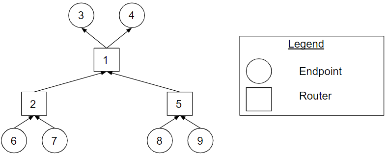
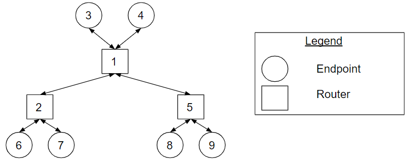

# Tree Topology Types

## Overview

The tree topology is a hierarchical topology with a root node and children
nodes. The radix of a node defines the number of children nodes for the given
node. The nodes represent the router nodes and endpoint nodes of a network. A
tree topology has endpoints connected to the root router and leaf routers. It is
called a tree topology because the router nodes form a tree data structure.

 \
**Figure Tree\_Topology\_Example. A tree topology example.**

Figure Tree\_Topology\_Example shows an example of a tree topology. In the
figure, there are nine nodes: three router nodes and six endpoint nodes. Router
1 is a root router, and routers 2 and 5 are leaf routers. Router 1 has a radix
of four, and routers 2 and 5 have a radix of two. Routers 2 and 5 are child
routers of router 1. Endpoints 3 and 4 are child endpoints of router 1.
Endpoints 6 and 7, and endpoints 8 and 9 are child endpoints of router 2 and
router 5 respectively.

## Unidirectional Types

A unidirectional tree is a tree topology where the communication flow is
unidirectional, thus all channels in the tree are unidirectional. There are two
unidirectional tree types: aggregation tree and distribution tree.

### Aggregation Tree

In the aggregation tree, the communication flow is from the leaf routers of the
tree to the root router of the tree. The endpoints connected to the root router
receive from the network, and the endpoints connected to the leaf routers send
to the network.

 \
**Figure Aggregation\_Tree\_Topology\_Example. The aggregation tree topology
representation of the tree in Figure Tree\_Topology\_Example.**

Figure Aggregation\_Tree\_Topology\_Example shows the aggregation tree topology
representation of the tree in Figure Tree\_Topology\_Example. Endpoints 6, 7, 8
and 9 send to the network, and endpoints 3 and 4 receive from the network.

### Distribution Tree

In the distribution tree, the communication flow is from the root router of the
tree to the leaf routers of the tree. The endpoints connected to the root router
send to the network, and the endpoints connected to the leaf routers receive
from the network.

 \
**Figure Distribution\_Tree\_Topology\_Example. The distribution tree topology
representation of the tree in Figure Tree\_Topology\_Example.**

Figure Distribution\_Tree\_Topology\_Example shows the distribution tree
topology representation of the tree in Figure Tree\_Topology\_Example. Endpoints
3 and 4 send to the network, and endpoints 6, 7, 8 and 9 receive from the
network.

## Bidirectional Type {#bidirectional_tree}

A bidirectional tree is a tree topology where the communication flow is
bidirectional. The communication flows: from the root router of the tree to the
leaf routers of the tree and
from the leaf routers of the tree to the root router of the tree. By definition,
a bidirectional tree requires: 1) at least one endpoint connected to the root
router that sends to the network, 2) at least one endpoint connected to the root
router that receives from the network, 3) at least one endpoint connected to the
leaf routers that sends to the network, and 4) at least one endpoint connected
to the leaf routers that receives from the network. In practice, it is common to
have all endpoints connected to the root router and leaf routers send to and
receive from the network.

 \
**Figure Bidirectional\_Tree\_Topology\_Example. The bidirectional tree topology
representation of the tree in Figure Tree\_Topology\_Example.**

Figure Bidirectional\_Tree\_Topology\_Example shows the bidirectional tree
topology representation of the tree in Figure Tree\_Topology\_Example. All
endpoints in the tree send to and receive from the network.

## Cheat Sheet
*   A tree topology has endpoints connected to the root router and leaf routers.
*   Unidirectional Trees
    *   In the aggregation tree, the communication flow is from the leaf routers
    of the tree to the root router of the tree.
    *   In the distribution tree, the communication flow is from the root router
    of the tree to the leaf routers of the tree.
*   The communication flow of bidirectional trees is: from the root router of
    the tree to the leaf routers of the tree
    and from the leaf routers of
    the tree to the root router of the tree.